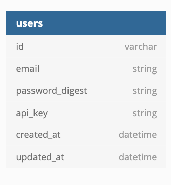

# Whether-Sweater
[View Whether Sweater on Heroku](https://whether--sweater.herokuapp.com/api/v1)

<!-- PROJECT SHIELDS -->
[![Contributors][contributors-shield]][contributors-url]
[![Forks][forks-shield]][forks-url]
[![Stargazers][stars-shield]][stars-url]
[![Issues][issues-shield]][issues-url]
[](https://travis-ci.com/github/Jonathan-M-Wilson/Whether-Sweater)

  <h3 align="center">Whether-Sweater</h3>

  <p align="center">
    Whether-Sweater is a backend application designed to satisfy the needs of a front-end team who are developing an application to create a road trip weather planning app. This application builds out the endpoints based off the wireframes supplied by the front-end.
    <br />
    <a href="https://github.com/Jonathan-M-Wilson/Whether-Sweater"><strong>Explore the docs »</strong></a>
    <br />
    <br />
    <!-- for adding a demo video
    <a href="Add our video link here">View Demo</a>  · -->
    ·
    <a href="https://github.com/Jonathan-M-Wilson/Whether-Sweater/issues">Report Bug</a>
    ·
    <a href="https://github.com/Jonathan-M-Wilson/Whether-Sweater/issues">Request Feature</a>
  </p>
</p>


<!-- TABLE OF CONTENTS -->
## Table of Contents

* [About the Project](#about-the-project)
  * [Built With](#built-with)
* [Getting Started](#getting-started)
  * [Prerequisites](#prerequisites)
  * [Configuration](#configuration)
  * [Testing](#testing)
  * [Endpoints](#endpoints)
  * [Wireframes](#wireframes)
* [Roadmap](#roadmap)
* [Contributing](#contributing)
* [Contact](#contact)
* [Acknowledgements](#acknowledgements)


<!-- ABOUT THE PROJECT -->
## About The Project

Whether Sweater is a 5-day, solo project during module three, of Turing School's Back-End Engineering Program.

This application is a web application designed to consume and produce API's. The application utilizes Ruby on Rails, with a PostgrSQL database.

To use this application in production to test out the endpoints, please visit [Whether--Sweater](https://whether--sweater.herokuapp.com/api/v1) on Heroku!

### Built With

* [Ruby](https://github.com/ruby/ruby)
* [Rails](https://github.com/rails/rails)

<!-- GETTING STARTED -->
## Getting Started

To use Whether Sweater locally, you can fork or clone [this](https://github.com/Jonathan-M-Wilson/Whether-Sweater) repo.


### Configuration

1. Clone this repo `git clone git@github.com:Jonathan-M-Wilson/Whether-Sweater.git`

2. Enter the directory where it was cloned `cd Whether-Sweater`

3. Run `bundle install` to install gems and dependencies

4. Run `bundle exec rails db:{create,migrate}` to set up the database

5. Run `bundle exec figaro install`
- This application utilizes 4 different apis. Inside your application.yml file the above command created, you will need to add api keys for the following;

  * Add `MAPQUEST_CONSUMER_KEY: <KEY HERE>`

  * Add `OPEN_WEATHER_API_KEY: <KEY HERE>`

  * Add `UNSPLASH_API_KEY: <KEY HERE>`

  * Add `YELP_API_KEY: <KEY HERE>`


### Testing

Whether Sweater has been fully tested. To view the test coverage;

Once inside your terminal within the Whether Sweater directory, run the following command.
```
open coverage
```

This will open up a folder with an index.html file. Clicking on this file will show you a list of all lines of code within this project, and whether they have been tested or not.

Additionally, running ```bundle exec rspec``` will show you the quick summary of the test coverage in this application.


### Schema
Our schema only includes one table, which is a users table.

<details>
<br /><br />
</details>


### Endpoints
Below you will find a list of the endpoints within Whether Sweater.

[](https://app.getpostman.com/run-collection/f56ae596c9bcd1b393a8)

##### GET /forecast
<details>

<summary>
TLDR: Returns the forecast for a specified city or location.
</summary><br />

The /forecast endpoint takes the query city or location and sends it to the MapQuest Geocoding service, where the latitude and longitude are retrieved to then be used in the OpenWeather service. Returns Current Weather, an array of the next 5 days of daily weather, and an array of the next 8 hours of hourly weather.

Example Request: ```GET /api/v1/forecast?location=kenai,ak```


Response:
<details>

```
{
    "data": {
        "id": null,
        "type": "forecast",
        "attributes": {
            "location": "'kenai,ak'",
            "current_weather": {
                "datetime": "2021-01-19 21:01:27 UTC",
                "sunrise": "2021-01-19 18:49:03 UTC",
                "sunset": "2021-01-20 01:42:16 UTC",
                "temperature": 29.34,
                "feels_like": 14.81,
                "humidity": 74,
                "uvi": 0.22,
                "visibility": 10000,
                "conditions": "clear sky",
                "icon": "http://openweathermap.org/img/wn/01d@2x.png"
            },
            "daily_weather": [
                {
                    "date": "2021-01-20",
                    "sunrise": "2021-01-20 18:47:09+00:00",
                    "sunset": "2021-01-21 01:44:46+00:00",
                    "max_temp": 27.57,
                    "min_temp": 24.4,
                    "conditions": "overcast clouds",
                    "icon": "http://openweathermap.org/img/wn/04d@2x.png"
                },
                {
                    "date": "2021-01-21",
                    "sunrise": "2021-01-21 18:45:11+00:00",
                    "sunset": "2021-01-22 01:47:18+00:00",
                    "max_temp": 28.29,
                    "min_temp": 23.86,
                    "conditions": "overcast clouds",
                    "icon": "http://openweathermap.org/img/wn/04d@2x.png"
                },
                {
                    "date": "2021-01-22",
                    "sunrise": "2021-01-22 18:43:11+00:00",
                    "sunset": "2021-01-23 01:49:51+00:00",
                    "max_temp": 29.17,
                    "min_temp": 26.58,
                    "conditions": "overcast clouds",
                    "icon": "http://openweathermap.org/img/wn/04d@2x.png"
                },
                {
                    "date": "2021-01-23",
                    "sunrise": "2021-01-23 18:41:07+00:00",
                    "sunset": "2021-01-24 01:52:26+00:00",
                    "max_temp": 30.02,
                    "min_temp": 28.2,
                    "conditions": "snow",
                    "icon": "http://openweathermap.org/img/wn/13d@2x.png"
                },
                {
                    "date": "2021-01-24",
                    "sunrise": "2021-01-24 18:39:01+00:00",
                    "sunset": "2021-01-25 01:55:03+00:00",
                    "max_temp": 28,
                    "min_temp": 20.21,
                    "conditions": "scattered clouds",
                    "icon": "http://openweathermap.org/img/wn/03d@2x.png"
                }
            ],
            "hourly_weather": [
                {
                    "time": "22:00:00",
                    "temperature": 28.44,
                    "wind_speed": "13.71 mph",
                    "wind_direction": "S",
                    "conditions": "clear sky",
                    "icon": "http://openweathermap.org/img/wn/01d@2x.png"
                },
                {
                    "time": "23:00:00",
                    "temperature": 28.2,
                    "wind_speed": "11.63 mph",
                    "wind_direction": "S",
                    "conditions": "clear sky",
                    "icon": "http://openweathermap.org/img/wn/01d@2x.png"
                },
                {
                    "time": "00:00:00",
                    "temperature": 27.88,
                    "wind_speed": "8.55 mph",
                    "wind_direction": "S",
                    "conditions": "clear sky",
                    "icon": "http://openweathermap.org/img/wn/01d@2x.png"
                },
                {
                    "time": "01:00:00",
                    "temperature": 26.6,
                    "wind_speed": "5.7 mph",
                    "wind_direction": "SSW",
                    "conditions": "broken clouds",
                    "icon": "http://openweathermap.org/img/wn/04d@2x.png"
                },
                {
                    "time": "02:00:00",
                    "temperature": 25.5,
                    "wind_speed": "3.22 mph",
                    "wind_direction": "SW",
                    "conditions": "broken clouds",
                    "icon": "http://openweathermap.org/img/wn/04n@2x.png"
                },
                {
                    "time": "03:00:00",
                    "temperature": 25.16,
                    "wind_speed": "0.85 mph",
                    "wind_direction": "NNE",
                    "conditions": "overcast clouds",
                    "icon": "http://openweathermap.org/img/wn/04n@2x.png"
                },
                {
                    "time": "04:00:00",
                    "temperature": 25.68,
                    "wind_speed": "3.13 mph",
                    "wind_direction": "NNE",
                    "conditions": "overcast clouds",
                    "icon": "http://openweathermap.org/img/wn/04n@2x.png"
                },
                {
                    "time": "05:00:00",
                    "temperature": 25.38,
                    "wind_speed": "5.91 mph",
                    "wind_direction": "N",
                    "conditions": "light snow",
                    "icon": "http://openweathermap.org/img/wn/13n@2x.png"
                }
            ]
        }
    }
}
```
</details>
</details><br />


##### GET /background
<details>

<summary>
TLDR: The frontend developers needed an endpoint to fetch a background image for that page showing the city
</summary><br />

This endpoint utilizes the Unplash api, to use the name of a city or location to retrieve an appropriate background image.


Example Request: ```GET /api/v1/backgrounds?location='City Of Denver'```

Response:
<details>

```
{
    "data": {
        "id": null,
        "type": "image",
        "attributes": {
            "image": {
                "location": "'City Of Denver'",
                "image_url": "https://images.unsplash.com/photo-1603033156166-2ae22eb2b7e2?ixid=MXwxOTkzODh8MHwxfHNlYXJjaHwxfHwnQ2l0eSUyME9mJTIwRGVudmVyJ3xlbnwwfHx8&ixlib=rb-1.2.1",
                "credit": {
                    "source": "https://unsplash.com/",
                    "author": "andrewcoop",
                    "logo": "https://unsplash.com/blog/content/images/max/2560/1-VnKoValwGK3-d1bZhD6sVA.jpeg"
                }
            }
        }
    }
}
```
</details>
</details><br />


##### Post /users
<details>

<summary>
TLDR: Post endpoint for registration
</summary><br />

This endpoint sends a JSON payload in the body of the request.

A successful request creates a user in your database, and generates a unique api key associated with that user, with a 201 status code.

An unsuccessful request returns an appropriate 400-level status code and body with a description of why the request wasn’t successful.


Example Request: ```POST /api/v1/users```

Payload Example:

```
{
  "email": "testing@example.com",
  "password": "password",
  "password_confirmation": "password"
}
```

Response:

<details>

```
{
    "data": {
        "id": "3",
        "type": "users",
        "attributes": {
            "email": "testing@example.com",
            "api_key": "6fkgPPTGQZMDRrpSp9IyJg"
        }
    }
}
```

</details><br />
</details><br />


##### Post /sessions
<details>

<summary>
TLDR: Post endpoint for login.
</summary><br />

This endpoint sends a JSON payload in the body of the request.

A successful request returns the user’s api key.

An unsuccessful request returns an appropriate 400-level status code and body with a description of why the request wasn’t successful.


Example Request: ```POST /api/v1/sessions```


Payload Example:
```
{
  "email": "testing@example.com",
  "password": "password"
}
```

Response:

<details>

```
{
    "data": {
        "id": "3",
        "type": "users",
        "attributes": {
            "email": "testing@example.com",
            "api_key": "6fkgPPTGQZMDRrpSp9IyJg"
        }
    }
}
```
</details><br />
</details><br />


##### Post /road_trip
<details>

<summary>
TLDR: Post endpoint for new feature where users can plan road trips.
</summary><br />

This endpoint sends a JSON payload in the body of the request.

API key must be sent

If no API key is given, or an incorrect key is provided, return 401 (Unauthorized)

An unsuccessful request returns an appropriate 400-level status code and body with a description of why the request wasn’t successful.

This endpoint will return a travel time of "impossible" and a nil weather block if an impossible route is inputted. For example, Traveling from New York, NY to London, UK, weather block will be nil and travel time will equal “impossible”.


Example Request: ```POST /api/v1/users```


Payload Example:
```
{
    "origin": "Denver,Co",
    "destination": "Pueblo,Co",
    "api_key": "Nn0tBoFUsUmiE7u5RFTvkw"
}

```

Response:

<details>

```
{
    "data": {
        "id": null,
        "type": "roadtrip",
        "attributes": {
            "start_city": "Denver,Co",
            "end_city": "Pueblo,Co",
            "travel_time": "1 hour, 44 minutes",
            "weather_at_eta": {
                "temperature": 35.19,
                "conditions": "scattered clouds"
            }
        }
    }
}
```
</details><br />
</details><br />


## Wireframes
<details>

<summary>
Listed below are the wireframes provided for this project.
</summary><br />

Root:


<br /><br />

Sign Up:


<br /><br />

Login:


<br /><br />

Road Trip:

<br /><br />

</details>

<!-- ROADMAP -->
## Roadmap

See the [open issues](https://github.com/Jonathan-M-Wilson/Whether-Sweater/issues) for a list of proposed features, known issues, and project extensions.


<!-- CONTRIBUTING -->
## Contributing

Contributions are what make this community such an amazing and fun place to learn, grow, and create! Any contributions you make are **greatly appreciated**.

1. Fork the Project
2. Create your Feature Branch ```git checkout -b feature/NewGreatFeature```
3. Commit your Changes ```git commit -m 'Add some NewGreatFeature'```
4. Push to the Branch ```git push origin feature/NewGreatFeature```
5. Open a new Pull Request!


<!-- CONTACT -->
## Contact

Jonathan Wilson - [![LinkedIn][linkedin-shield]](https://www.linkedin.com/in/jonathan--wilson/) - [GitHub](https://github.com/Jonathan-M-Wilson)


Project Link: [Whether Sweater](https://github.com/Jonathan-M-Wilson/Whether-Sweater)


<!-- ACKNOWLEDGEMENTS -->
<!-- Add resources that were used to help create this project here -->


<!-- MARKDOWN LINKS & IMAGES -->
[contributors-shield]: https://img.shields.io/github/contributors/Jonathan-M-Wilson/Whether-Sweater
[contributors-url]: https://github.com/Jonathan-M-Wilson/Whether-Sweater/graphs/contributors
[forks-shield]: https://img.shields.io/github/forks/Jonathan-M-Wilson/Whether-Sweater
[forks-url]: https://github.com/Jonathan-M-Wilson/Whether-Sweater/network/members
[stars-shield]: https://img.shields.io/github/stars/Jonathan-M-Wilson/Whether-Sweater
[stars-url]: https://github.com/Jonathan-M-Wilson/Whether-Sweater/stargazers
[issues-shield]: https://img.shields.io/github/issues/Jonathan-M-Wilson/Whether-Sweater
[issues-url]: https://github.com/Jonathan-M-Wilson/Whether-Sweater/issues
[linkedin-shield]: https://img.shields.io/badge/-LinkedIn-black.svg?style=flat-square&logo=linkedin&colorB=555
